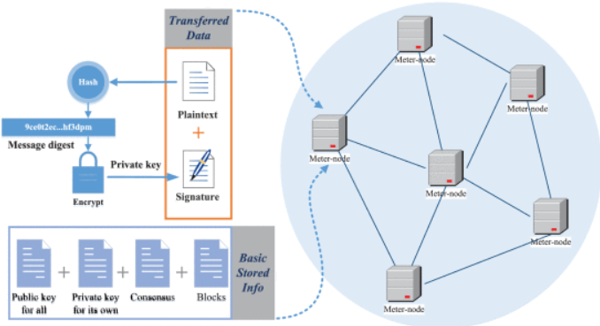

# 《基于分布式区块链的数据保护框架用于现代电力系统免受网络攻击》论文笔记

## 论文基本信息

- 标题：基于分布式区块链的数据保护框架用于现代电力系统免受网络攻击
- 英文标题：Distributed Blockchain-Based Data Protection Framework for Modern Power Systems Against Cyber Attacks
- 作者：[Gaoqi Liang ](https://ieeexplore.ieee.org/author/37085889501); [Steven R. Weller ](https://ieeexplore.ieee.org/author/37078084700); [Fengji Luo ](https://ieeexplore.ieee.org/author/37400605900); [Junhua Z](https://ieeexplore.ieee.org/author/37537644000)
- 出处： [IEEE Transactions on Smart Grid](https://ieeexplore.ieee.org/xpl/RecentIssue.jsp?punumber=5165411) ( Volume: 10 , [Issue: 3](https://ieeexplore.ieee.org/xpl/tocresult.jsp?isnumber=8694132) , May 2019 )
- 链接：https://ieeexplore.ieee.org/document/8326530
- 论文笔记作者：王沛然
- Email：1183097399@qq.com

## 论文简要

现代电力系统极端依赖于通信和控制技术，在提高电力系统效率的同时也带来了遭遇网络攻击的风险。

作者在本文中提出了一种基于分布式区块链的保护框架来增强现代电力系统抵御网络攻击的自防御能力。作者将电表用作将电表测量值封装为块的分布式网络节点，讨论了如何使用区块链技术增强智能电网系统的鲁棒性和安全性。

## 主要内容

为了构建区块链框架，现有的SCADA网络必须重新配置，每个电表由数据收集设备、信号发送器、信号接收器和数据处理设备组成。数据采集模块从电网上实时收集测量值，包括电压、电流、有功和无功功率流量等。在地理上分散分布的各个仪表组成了分布式仪表节点网络。用一条通信路径链接每一个节点，对指定的节点分配数据采集权限。由于形成了一条路径，每个节点相互依存，相当于一个区块链网络，各个节点基于共识机制自动执行数据的收集、传输和验证。

每个仪表需要有：

- 唯一的地址标识
- 生成公钥和私钥的软件
- 每个仪表都配备计算和存储设备
- 仪表通过无线和有线链路通信

公钥是每一个节点的对外开放的可访问信息，在整个电路区块链网络中公开；私钥用于验证节点身份。每个节点在收到数据后，将数据广播到整个区块链网络：

每个节点传输的数据由文本和签名组成。在加密过程中使用哈希算法处理收集到的明文数据，得到消息摘要。每个节点的私钥用来加密消息摘要，从而形成数字签名，然后通过广播将传输的数据广播到其他节点。

接收到广播信息的所有节点都需要解密收到的数据并进行验证。接收方将收到的明文散列到消息摘要1中，然后使用发送方公钥从数字签名中解密消息摘要2，如果摘要1与摘要2一样，则验证成功。

所有节点使用基于地址的分布式投票机制，使得每一个节点恰好有一个机会验证接收到的数据的完整性和一致性。

## 文章优缺点

### 创新点

- 创新地将原本用于金融技术的区块链技术应用于智能电网
- 创新地将每一个节点视为矿工

### 缺点

- 这项技术的应用需要显著提升现有的智能电网基础设施的算力
- 作者没有考虑区块链技术的带入将给智能电网带来的新的对于区块链的攻击风险
- 由于在传输的过程中电网网络需要进行大量计算和验证，导致智能电网的实时性降低
- 遭到DDOS攻击的危险性变大
